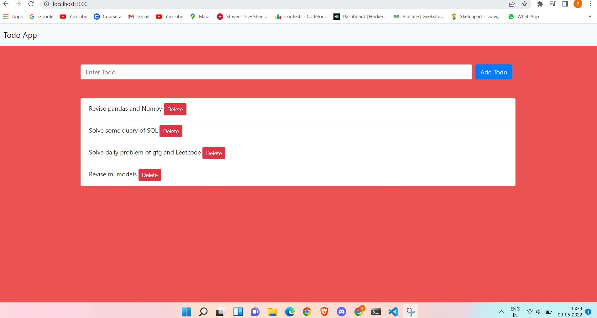

# Todo_App
To_do_App


To do app using Node.js and express .js
## Screenshots

<p>
    
</p>


# In order to make the app work first install the dependencies by running the following command on your terminal

```
npm install
```


In the project directory, you can run:
### `npm run dev`
Runs the app in the development mode.\
Open [http://localhost:3000](http://localhost:3000) to view it in your browser.
